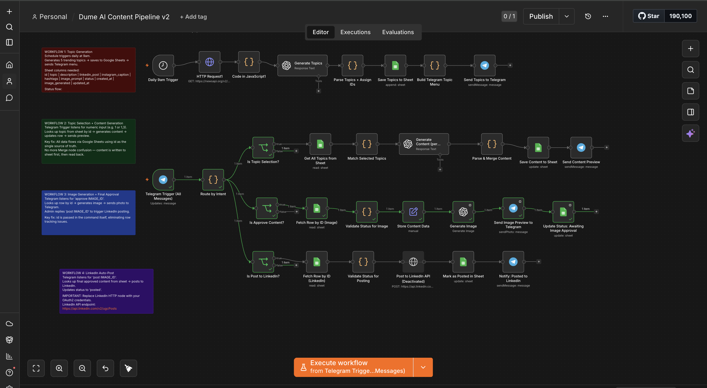

# Dume AI Autopilot

```Your AI content intern that never sleeps.```



An AI-powered content automation system built with n8n, OpenAI, Reddit, Telegram, and Google Sheets that automatically discovers trending topics, generates platform-ready content, creates engaging visuals, manages approval workflows, and publishes content with minimal human intervention.
#  Detailed Workflow Architecture

## 1. Trend Discovery Engine

The automation pipeline starts with a scheduled trigger that runs at a predefined time each day.

### Process

1. Schedule Trigger activates the workflow.
2. Reddit API fetches trending discussions from AI, SaaS, Startup, and Automation-related communities.
3. OpenAI analyzes the collected discussions and identifies high-potential content opportunities.
4. AI generates:

   * Topic Title
   * Topic Description
   * Topic ID
5. Topics are stored in Google Sheets for tracking and future processing.
6. A Telegram message is sent containing the generated topic list.

### Output Example

```text
🔥 Today's Trending Topics

1. How AI Agents Are Changing Team Productivity
2. Why Workflow Automation Is Becoming Essential
3. The Rise of Vertical AI Startups

Reply with:
1
or
1,3
```

---

## 2. Topic Selection & Content Generation

A human-in-the-loop approval process ensures content quality before generation.

### Process

1. User selects one or more topics through Telegram.
2. Workflow validates the selected IDs.
3. Google Sheets retrieves the corresponding topic records.
4. OpenAI generates:

   * LinkedIn Post
   * Instagram Caption
   * Hashtags
   * Visual Strategy
   * Image Prompt
5. Generated content is stored in Google Sheets.
6. Status is updated to:

```text
awaiting_approval
```

7. Content preview is sent to Telegram.

### Output Example

```text
🚀 Content Preview

📝 LinkedIn Post
...

📸 Instagram Caption
...

🔥 Hashtags
...

Reply:
approve 5
or
reject 5
```

---

## 3. Content Approval Workflow

This stage introduces human review before visual generation.

### Process

1. Telegram receives:

   * approve {id}
   * reject {id}

2. Workflow extracts the content ID.

3. System updates status:

```text
approved_for_visual
```

or

```text
rejected
```

4. Approved content moves to visual generation.

---

## 4. AI Visual Generation Engine

Instead of generating generic AI images, the system generates educational and engagement-focused visuals.

### Supported Visual Types

* Visual Analogies
* Side-by-Side Comparisons
* Process Diagrams
* Story-Based Illustrations
* Statistics Infographics
* Editorial LinkedIn Graphics

### Process

1. AI determines the most suitable visual format.
2. A detailed image prompt is generated.
3. Image generation model creates the visual.
4. Generated image is sent to Telegram.
5. Image metadata is saved in Google Sheets.

### Status Update

```text
awaiting_final_approval
```

---

## 5. Final Review & Publishing

A final review stage ensures only approved content is published.

### Process

User responds:

```text
final approve 5
```

or

```text
reject 5
```

Workflow validates status and content ID.

If approved:

* Update status to:

```text
ready_to_publish
```

* Trigger publishing workflow.

---

## 6. LinkedIn Publishing Workflow

### Process

1. Retrieve approved content.
2. Validate:

   * Status = ready_to_publish
   * Image exists
3. Connect to LinkedIn API.
4. Publish post.
5. Update Google Sheets:

```text
status = published
published_at = timestamp
```

6. Send Telegram confirmation.

### Output Example

```text
✅ Post Published Successfully

Topic:
How AI Agents Are Changing Team Productivity

Published At:
2026-05-29 10:30 AM
```

---

#  Data Storage Structure

Google Sheets acts as the workflow database.

### Columns

| Column            | Purpose                          |
| ----------------- | -------------------------------- |
| id                | Unique topic identifier          |
| topic             | Generated topic title            |
| description       | Topic summary                    |
| linkedin_post     | LinkedIn content                 |
| instagram_caption | Instagram caption                |
| hashtags          | Generated hashtags               |
| image_type        | Visual strategy                  |
| image_prompt      | Prompt used for image generation |
| image_generated   | Boolean flag                     |
| status            | Workflow state                   |
| created_at        | Creation timestamp               |
| published_at      | Publishing timestamp             |

---

# Workflow States

```text
topic_generated
        ↓
content_generated
        ↓
awaiting_approval
        ↓
approved_for_visual
        ↓
awaiting_final_approval
        ↓
ready_to_publish
        ↓
published
```

---

# Key Design Principles

* Human-in-the-loop approvals
* AI-assisted content creation
* State-driven workflow orchestration
* Trend-first content strategy
* Modular workflow architecture
* Scalable publishing pipeline
* Low-code implementation using n8n
